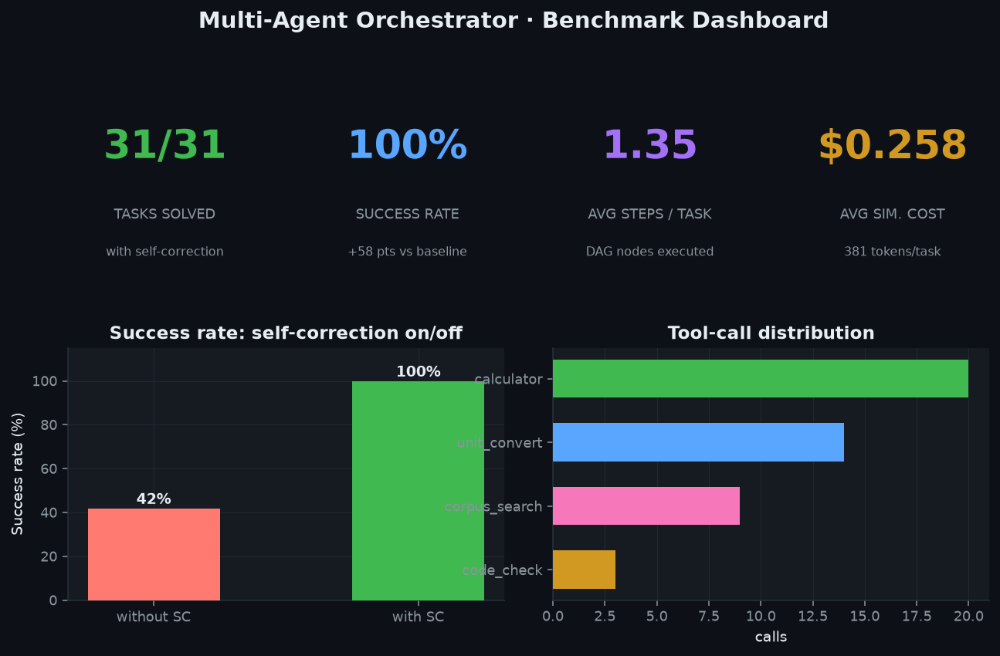
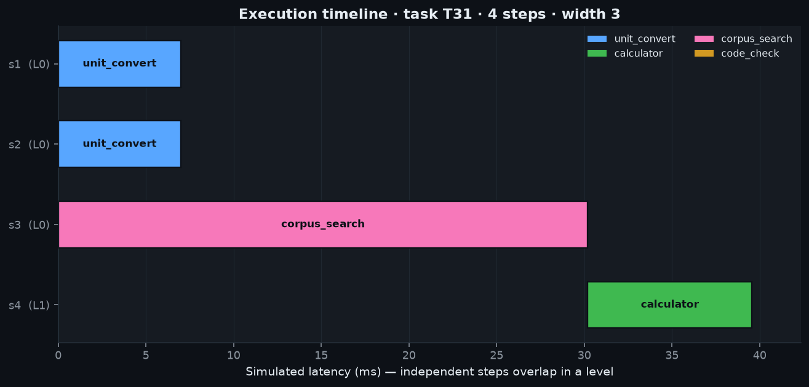
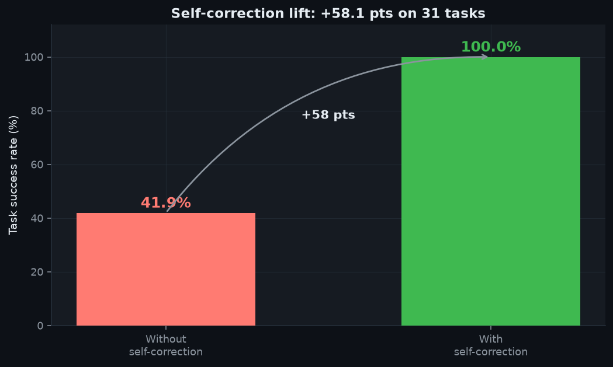
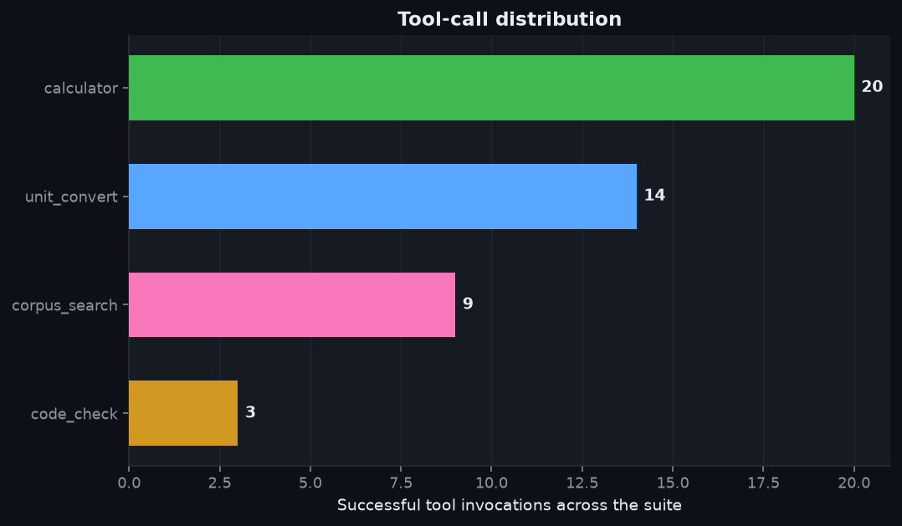

# Multi-Agent Orchestrator

A from-scratch agentic framework — LangGraph / AutoGPT-class, but a clean,
dependency-light design of its own. A **planner** decomposes a natural-language
task into a **DAG of tool calls**; an **executor** runs that DAG respecting
dependencies and running independent branches in parallel; **guardrails** validate
inputs, tool arguments, and outputs; and a **self-correction loop** turns real
execution feedback into a repaired plan and retries.

Everything runs **fully offline and deterministically**. There is no external LLM
API. The "reasoning" is provided by a deterministic rule/pattern policy that sits
behind a clean `LLMEngine` interface, so a real model can be dropped in unchanged.

> **Headline result (31-task benchmark, measured):** the self-correction loop
> lifts task success from **41.9% → 100.0%** — a **+58.1 point** improvement —
> at an average of **1.58 attempts** and **$0.259** simulated cost per task.

---

## Why this is interesting

Agent frameworks live or die on two things: **planning into a correct dependency
graph**, and **recovering from the model's inevitable mistakes**. This project
builds both as real, testable components and *measures* the payoff of recovery.

The offline engine is intentionally *fast and imperfect* on its first pass —
exactly like a language model producing plausible-but-wrong tool calls:

| First-pass mistake (realistic)                    | Guardrail that catches it | Repair applied                    |
|---------------------------------------------------|---------------------------|-----------------------------------|
| `2 ^ 10` (uses bitwise-xor for power)             | tool error                | rewrite `^` → `**`                |
| `Convert 10 kilometers to miles` (English units)  | tool error (unknown unit) | normalize `kilometers→km`, `miles→mi` |
| code snippet passed under the wrong arg key       | **schema** validation     | move value to the `code` key      |
| returns `0.375` when asked for a percentage       | **output** contract       | wrap expression `× 100`           |

None of these repairs peek at the ground-truth answer — the loop only ever sees
execution feedback, so every point of lift is earned.

---

## Architecture

```
                          ┌──────────────────────────────────────────────┐
   task prompt  ─────────▶│                   AGENT                       │
   "Convert 12 km to mi   │  engine · toolbox · blackboard · bus · exec   │
    and ... then add"     └───────────────┬──────────────────────────────┘
                                          │
                       ┌──────────────────▼───────────────────┐
                       │  PLANNER  (LLMEngine interface)       │
                       │  OfflineRuleEngine: prompt → Steps    │
                       └──────────────────┬───────────────────┘
                                          │  list[Step]
                       ┌──────────────────▼───────────────────┐
                       │  DAG   Kahn topo-sort → parallel      │
                       │  levels;  $s1 / Ref edges; acyclic    │
                       └──────────────────┬───────────────────┘
                                          │  levels
                 ┌────────────────────────▼─────────────────────────┐
                 │                    EXECUTOR                        │
                 │  per level → ThreadPool (independent steps ‖)      │
                 │                                                    │
                 │  resolve Refs/$vars → validate_args ─┐  guardrails │
                 │        │                             │             │
                 │        ▼                             ▼             │
                 │   ┌─────────┐  ┌──────────┐  ┌──────────────┐      │
                 │   │calculator│  │unit_conv │  │corpus_search │ ...  │
                 │   │ (AST safe)│ │          │  │  (TF-IDF)    │      │
                 │   └────┬────┘  └────┬─────┘  └──────┬───────┘      │
                 │        └── results → Blackboard ────┘  MessageBus  │
                 │                     │                              │
                 │            validate_output (contract)              │
                 └─────────────────────┬──────────────────────────────┘
                                       │  ok? ── yes ─▶ final answer + trace
                                       │
                                       └── no ─▶ engine.repair(error) ─▶ retry
                                                 (self-correction, up to N)
```

Core abstractions: **`Tool`** (name, typed schema, `run`), **`Agent`**,
**`Blackboard`** (thread-safe shared memory + write history), **`MessageBus`**
(pub/sub event log), **`Planner`**, **`Executor`**, and the **`LLMEngine`**
interface with its offline implementation.

---

## Results (measured)

31-task suite, deterministic, offline. Full tables in
[`benchmarks/results.md`](benchmarks/results.md); raw per-task data in
[`benchmarks/results.csv`](benchmarks/results.csv).

| Condition                | Success rate | Solved | Avg steps | Avg attempts | Avg sim. cost | Avg tokens |
|--------------------------|--------------|--------|-----------|--------------|---------------|------------|
| Without self-correction  | 41.9%        | 13/31  | 1.35      | 1.00         | $0.16524      | 238        |
| **With self-correction** | **100.0%**   | 31/31  | 1.35      | 1.58         | $0.25834      | 381        |

**Self-correction lift: +58.1 percentage points.** The loop costs ~0.58 extra
attempts and ~$0.09 extra simulated spend per task to recover every otherwise-failing task.

Tool-call distribution (with correction): `calculator` 20, `unit_convert` 14,
`corpus_search` 9, `code_check` 3.

---

## Project Document

- Prepared for **Sai Veda**
- Publishing account: **Nikeshk834**
- Full handoff note: [`PROJECT_DOCUMENT.md`](./PROJECT_DOCUMENT.md)

## Screenshots

Generated from a real run by `make screenshots`.

**Benchmark dashboard** — tasks solved, success rate, avg steps, avg cost, and the on/off comparison.


**Execution timeline** — the DAG of the showcase task; three independent branches
(two conversions + a knowledge-base lookup) run in parallel on level 0, then a
`calculator` step combines them on level 1.


**Self-correction lift** &nbsp;·&nbsp; **Tool-call distribution**



---

## Quickstart

```bash
# 0) deps are numpy / scikit-learn / matplotlib / pytest (offline; no API keys)
make setup

# 1) run the tests (DAG topo-order, calculator AST safety, schema + output
#    guardrails, and that self-correction strictly improves success)
make test

# 2) run the benchmark suite -> benchmarks/results.{csv,md} + data/trace_showcase.json
make bench

# 3) render assets/*.png from the real run
make screenshots
```

Solve a single task programmatically:

```python
from orchestrator import Agent, AgentConfig
from orchestrator.llm import Task

agent = Agent(config=AgentConfig(self_correct=True, max_retries=3))
trace = agent.solve(Task(
    "demo",
    "Convert 12 kilometers to miles and convert 4 kilograms to pounds and "
    "search the knowledge base for speed of sound in air, then add all three results",
))
print(trace.success, round(trace.final_answer, 3), trace.attempts, trace.width)
# True 359.275 2 3
```

---

## Layout

```
03-multi-agent-orchestrator/
├── src/orchestrator/
│   ├── dag.py          # Step, Ref, DAG (Kahn topo-sort → parallel levels)
│   ├── tools.py        # Tool base + calculator(AST) / unit / corpus / code_check
│   ├── llm.py          # LLMEngine interface + OfflineRuleEngine (plan + repair)
│   ├── planner.py      # engine → validated DAG
│   ├── executor.py     # parallel exec, ref resolution, self-correction, tracing
│   ├── guardrails.py   # input / schema / output validators
│   ├── blackboard.py   # shared memory + message bus
│   ├── accounting.py   # simulated token/cost + latency model
│   ├── knowledge.py    # synthetic knowledge base
│   └── viztheme.py     # shared chart theme
├── tests/              # 69 assertions across DAG / calc / guardrails / tools / e2e
├── benchmarks/         # task suite (31) + runner + generated results
├── scripts/            # run_benchmark.py, make_screenshots.py
└── assets/             # generated PNGs
```

See [ARCHITECTURE.md](ARCHITECTURE.md) for design decisions, trade-offs, and how
this scales to a fleet of a billion task-executions.
